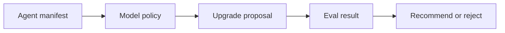

# agentops-lite

Most agent demos stop at the moment they first run.

That is usually the easy part.

The harder part starts a week later when:

- a vendor changes a model
- someone wants to swap a default
- output quality drifts
- nobody remembers what was safe to change

`agentops-lite` is a small answer to that problem.

It shows a reviewable loop for one agent workflow:

1. define what the agent is supposed to do
2. pin the policy it should follow
3. write down a proposed change before touching production
4. run an eval
5. promote only if the result holds up

The useful part is not bureaucracy.

The useful part is that you can hand this folder to another person and they can tell:

- what the agent is for
- what changed
- what was tested
- whether the change passed
- where human review still matters

That is a much better place to be than "we swapped the model and it seemed fine."

## Small workflow diagram

## What to open first

If you only have two minutes:

1. open [`upgrade_proposal.json`](./upgrade_proposal.json)
2. open [`eval_result.json`](./eval_result.json)

That is the heart of the loop.

If you want the full shape:

1. [`agent_manifest.json`](./agent_manifest.json)
2. [`model_policy.json`](./model_policy.json)
3. [`upgrade_proposal.json`](./upgrade_proposal.json)
4. [`eval_result.json`](./eval_result.json)

## Why this is useful

This pattern is useful any time an agent is doing work that people will rely on.

Think:

- research workflows that should stay tied to evidence
- browser automations that should not quietly get more aggressive
- internal tools where model swaps affect cost, quality, or review burden
- shared team workflows where "who changed what?" should not be a mystery

The point is not to slow the system down for fun.

The point is to keep the system inspectable when it starts mattering.

## The four files

### `agent_manifest.json`

The job description for the agent.

It says what goes in, what comes out, what tools it uses, how risky it is, and what kind of approval it needs.

### `model_policy.json`

The guardrails around model choice.

It says what is live, what is canary, what the fallback is, and what has to happen before a new model gets promoted.

### `upgrade_proposal.json`

The paper trail for a proposed change.

It makes the candidate, the hypothesis, the target metrics, and the rollback plan explicit before anyone starts talking themselves into a vague upgrade.

### `eval_result.json`

The receipt.

It shows what was tested, what passed, what failed, and what the decision was.

## What this example is based on

This public example is a simplified extraction from a larger private operating system I use for research, workflow automation, and vendor watch.

The private system does more.

This example does one thing better:

it is small enough to inspect without guesswork.
