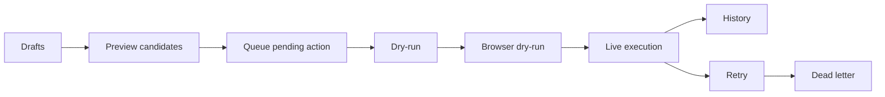

# browser-queue

Browser automation gets weird the moment it can do something irreversible.

Reading a page is easy.

Clicking "send", "publish", "reply", or "submit" is where the tone changes.

`browser-queue` is a small pattern for keeping that moment boring.

The idea is simple:

- drafts become queue items
- queue items stay pending until a run picks them up
- dry-run mode proves the logic without touching the browser
- browser dry-run proves the navigation without pressing the final button
- failures retry a few times
- repeated failures move to dead-letter instead of silently spinning forever

This is useful because most automation horror stories start with a workflow that skipped one of those steps.

## What to open first

If you want the quick version:

1. open [`queue.json`](./queue.json)
2. open [`dead_letter.jsonl`](./dead_letter.jsonl)
3. then read [`run_modes.md`](./run_modes.md)

That is enough to understand the operating shape.

## Why this is useful

This pattern is not only for social posting.

It is useful any time a browser workflow should be staged before it executes:

- publishing content
- replying from drafts
- customer-support actions
- admin workflows with real consequences
- any automation where "just let the agent click it" is a bad idea

The point is not caution for its own sake.

The point is giving yourself one more chance to catch bad output before it turns into a visible action.

## The files

### `queue.json`

The pending work.

Each item has an id, action type, text payload, current status, retry count, and timestamps.

### `dead_letter.jsonl`

The work that did not make it.

This is where failed actions go after retry attempts are exhausted, so you can inspect what broke instead of pretending it never happened.

### `run_modes.md`

The operating discipline.

It shows the difference between:

- preview
- enqueue
- dry-run
- browser dry-run
- live execution

That split is the whole point.

## Small workflow diagram

## What I like about this pattern

It keeps automation useful without making it theatrical.

You still get speed.

You still get leverage.

You just avoid the fake confidence that comes from pretending a browser agent should go straight from draft to live action with no pause in the middle.
